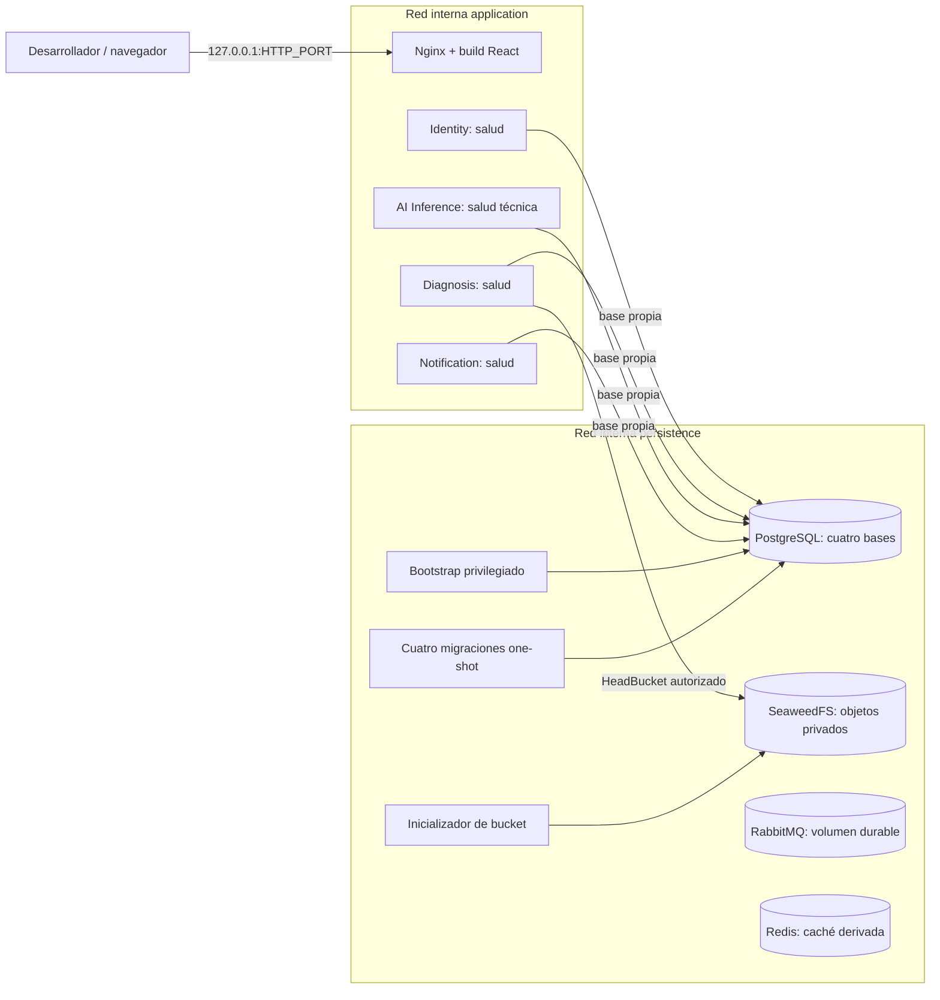

# C4 — contenedores del entorno técnico local

Alcance del grupo4 del Incremento0. APIs solo de salud; ninguna ruta de negocio funciona todavía. El host/auditoría se conserva aparte.

Una red edge exclusiva de Nginx permite publicar loopback; las redes application/persistence siguen internas. Nginx sirve estáticos; no enruta salud, `/internal`, AI ni negocio pendiente. Las APIs comparten red application para el enrutamiento futuro, pero no tienen puertos publicados. La red persistence tampoco publica puertos. No hay conexión funcional de las APIs a RabbitMQ/Redis: las pruebas técnicas los verifican por separado.

Orden de arranque: PostgreSQL saludable → bootstrap → migración propia → API; S3 saludable → inicializador privado → Diagnosis. Nginx espera APIs saludables. Cada servicio mantiene su volumen/credencial propios según corresponda; Redis es prescindible y no requiere volumen.

La producción sigue pendiente: dominio, Cloudflare Full(strict), TLS válido hasta el origen, CDN de estáticos y controles de operación. HTTP loopback y esta página técnica no prueban despliegue público ni diagnóstico.
