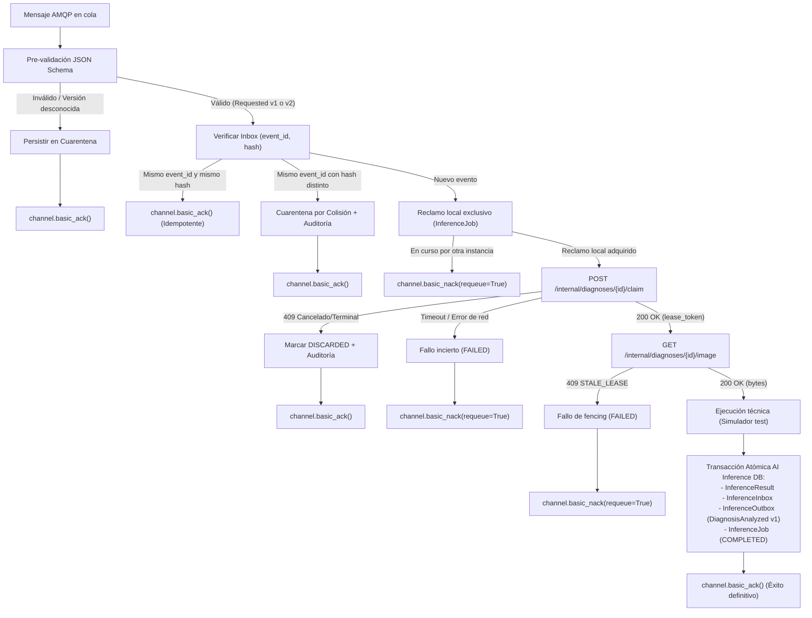

# Contrato de Trabajo y Protocolo ACK del Worker de Inferencia

En conformidad con ADR-0008 (D1, D2, D3, D4, D6, D7) y las tareas 5.1 a 5.4 del Incremento 3.

---

## 1. Alcance y Ausencia de Modelo Real de ML

> [!IMPORTANT]
> **NO EXISTE MODELO DE MACHINE LEARNING REAL EN ESTE INCREMENTO.**
> El servicio `ai_inference` implementa en esta etapa la infraestructura asíncrona confiable (consumo AMQP, leases, atomicidad de outbox/inbox y contratos de fencing).
> Todo análisis técnico emitido en este incremento se genera a través de un simulador determinista provisional activo **únicamente** cuando `APP_ENV=test` y `ENABLE_SIMULATED_INFERENCE="true"`.
> En entornos Compose normales, desarrollo o producción, el worker falla cerrado (`fail-closed`) y rechaza cualquier inferencia simulada.

---

## 2. Aislamiento y Límites de Servicio

El worker de `ai_inference` opera bajo el principio de mínimos privilegios y estricto aislamiento de datos:
1. **Cero acceso a S3**: El worker no dispone de credenciales S3, cliente de almacenamiento ni acceso a buckets. La imagen se transfiere exclusivamente en memoria como cuerpo binario HTTP desde Diagnosis.
2. **Cero acceso a la base de datos de Diagnosis**: La base de datos `ai_inference` es privada e independiente. El worker nunca ejecuta consultas cruzadas ni mantiene claves foráneas hacia Diagnosis.
3. **Identidad interna verificada**: El worker se autentica ante `POST /internal/diagnoses/{id}/claim` y `GET /internal/diagnoses/{id}/image` mediante JWT firmado con su propia clave privada Ed25519 (algoritmo `EdDSA`), con vigencia máxima de 60 segundos y encabezado `kid` registrado en Diagnosis.
4. **Fencing estricto**: Cada solicitud de imagen debe presentar la cabecera `X-Lease-Token` con el token emitido durante el reclamo. Si el lease venció (`CURRENT_TIMESTAMP >= lease_expires_at`), Diagnosis responde `409 STALE_LEASE` y el worker detiene el trabajo de inmediato.

---

## 3. Protocolo de Consumo y ACK

El flujo de procesamiento de cada mensaje sigue una secuencia determinista con confirmación atómica previa al ACK de transporte:

---

## 4. Reglas del Protocolo ACK

1. **Pre-validación y cuarentena**:
   - Mensajes con JSON malformado o esquemas que no cumplan `DiagnosisRequested.v1.schema.json` o `DiagnosisRequested.v2.schema.json` (incluyendo versiones desconocidas como v3 o intentos de manipulación de carga) se aíslan en `inference_quarantine_messages` guardando únicamente su hash SHA-256, motivo y routing key.
   - El mensaje del broker se reconoce inmediatamente (`channel.basic_ack()`) para evitar el bloqueo indefinido de la cola.
2. **Deduplicación por Inbox**:
   - Clave única: `(consumer='ai_inference', event_id)`.
   - Si coincide el hash canónico SHA-256: es una reentrega (por caída tras commit o reintento de red). Se envía `basic_ack()` de inmediato sin volver a llamar a Diagnosis ni recalcular inferencia.
   - Si difiere el hash: es una colisión de integridad. Se audita, se registra en cuarentena y se envía `basic_ack()`, preservando intacto el registro original del inbox.
3. **Commit atómico antes de ACK**:
   - La inserción de `InferenceResult`, `InferenceInbox`, `InferenceOutbox` (con el evento `DiagnosisAnalyzed` v1) y la actualización de `InferenceJob` a `COMPLETED` se confirman en una única transacción de base de datos.
   - **SOLO después** del commit exitoso de la base de datos se emite `channel.basic_ack()`.
4. **Comportamiento ante caídas (Crashes)**:
   - Caída antes del commit: La transacción hace rollback; el broker reentrega el mensaje no confirmado; el worker lo procesa limpiamente.
   - Caída tras el commit pero antes de `basic_ack()`: La base de datos conserva el resultado y el inbox. Al redeliverar, el inbox detecta la coincidencia exacta de hash y emite `basic_ack()` de inmediato sin duplicar resultados ni outbox.
5. **Presupuesto de ejecución y fallos transitorios**:
   - Si ocurre un fallo transitorio de red (por ejemplo, al descargar la imagen) o error en la inferencia técnica, el intento queda consumido (marcando el trabajo local como `FAILED`).
   - El worker **NO** ejecuta bucles internos de reintento que consuman el presupuesto de 3 generaciones. La reemisión de intentos corresponde exclusivamente a la política de leases y recuperador de Diagnosis.

## Correcciones verificadas durante el cierre

El transporte conserva las entregas ante timeout, HTTP 5xx y 409 transitorio, con pausa de dos segundos entre reentregas. Solo un 409 con `details=[{"field":"status","code":"TERMINAL"}]` permite descartar definitivamente el reclamo; un 404 también es definitivo. El resultado de una generación anterior no sustituye la deduplicación por evento.

Un heartbeat renueva el lease por HTTP cada 20 segundos y prolonga el reclamo local bajo bloqueo. La confirmación del resultado exige conservar el token local y no haber perdido la renovación. Un error de imagen o inferencia conserva la entrega pendiente; Diagnosis sigue controlando el presupuesto de generaciones.

Los dos workers pertenecen al perfil Compose `async-test`. El consumidor Diagnosis solo permite la política sintética con `APP_ENV=test` y `ENABLE_SIMULATED_INFERENCE=true`, para la terna `synth-model-v1 / 0.1.0-synth / ds-synth-2026.1`. El umbral 0.9 es exclusivamente una condición del fixture, no una calibración agronómica. Fuera de esa política devuelve `UNSUPPORTED_CLASS`; por debajo del umbral devuelve `LOW_CONFIDENCE`.
