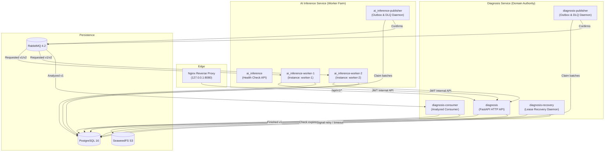

# Operación de Procesos de Fondo, Topología y Resiliencia

Este documento detalla la arquitectura operativa, topología de procesos, ciclos de vida de arranque y parada ordenada, y garantías de disponibilidad del sistema asíncrono implementado en el **Incremento 3** (conforme a [ADR-0008](../adr/0008-flujo-asincrono-confiable-y-leases-internos.md)).

---

## 1. Topología de Procesos de Fondo

A diferencia de modelos acoplados donde la publicación y el consumo corren dentro de hilos del servidor HTTP web, cada responsabilidad en AgroDiagnóstico se ejecuta como un proceso independiente en contenedores dedicados:



### Inventario de Procesos

| Proceso | Contenedor | Comando | Responsabilidad |
|---|---|---|---|
| `diagnosis-publisher` | `agrodiagnostico-v1-diagnosis-publisher-1` | `python -m app.publisher` | Publicación de eventos de negocio pendientes (`DiagnosisRequested.v2`) y descriptores DLQ hacia RabbitMQ con publisher confirms y mandatory=True. |
| `diagnosis-consumer` | `agrodiagnostico-v1-diagnosis-consumer-1` | `python -m app.consumer` | Consumo de `DiagnosisAnalyzed.v1`, deduplicación por inbox canónico, validación y transición atómica a estado terminal (`COMPLETADO`, `NO_CONCLUYENTE`, `FALLIDO`) y outbox de `DiagnosisFinished.v1`. |
| `diagnosis-recovery` | `agrodiagnostico-v1-diagnosis-recovery-1` | `python -m app.recovery` | Inspección periódica (1s) de leases expirados en `PROCESANDO`. Emisión de señal única con backoff (5s / 15s) o finalización terminal por `PROCESSING_TIMEOUT` al agotar presupuesto (3 intentos) o deadline (300s). |
| `ai_inference-publisher` | `agrodiagnostico-v1-ai_inference-publisher-1` | `python -m app.publisher` | Publicación de eventos `DiagnosisAnalyzed.v1` generados por los workers y descriptores DLQ hacia RabbitMQ. |
| `ai_inference-worker-1` | `agrodiagnostico-v1-ai_inference-worker-1-1` | `python -m app.worker` | Worker 1: reclamo local exclusivo, claim HTTP con JWT Ed25519, obtención segura de imagen vallada, inferencia técnica y confirmación atómica. |
| `ai_inference-worker-2` | `agrodiagnostico-v1-ai_inference-worker-2-1` | `python -m app.worker` | Worker 2: segunda réplica concurrente en competencia por trabajos. Demuestra exclusión mutua de claim y fencing. |

---

## 2. Indicadores de Disponibilidad (Readiness) por Proceso

Cada proceso de fondo gestiona un archivo marcador temporal en `/tmp/` que señaliza su estado listo y conectado al broker/base de datos. Docker Compose utiliza estos marcadores para sus healthchecks:

| Proceso | Archivo de Readiness | Verificación de Docker Compose |
|---|---|---|
| `diagnosis-publisher` | `/tmp/diagnosis_publisher_ready` | `test -f /tmp/diagnosis_publisher_ready` |
| `diagnosis-consumer` | `/tmp/diagnosis_consumer_ready` | `test -f /tmp/diagnosis_consumer_ready` |
| `diagnosis-recovery` | `/tmp/diagnosis_recovery_ready` | `test -f /tmp/diagnosis_recovery_ready` |
| `ai_inference-publisher` | `/tmp/ai_publisher_ready` | `test -f /tmp/ai_publisher_ready` |
| `ai_inference-worker-1` | `/tmp/ai_worker_ready_worker-1` | `test -f /tmp/ai_worker_ready_worker-1` |
| `ai_inference-worker-2` | `/tmp/ai_worker_ready_worker-2` | `test -f /tmp/ai_worker_ready_worker-2` |

- **Momento de creación:** Los consumidores crean el marcador después de conectarse y lo retiran al perder la conexión. En publicadores y recuperador el marcador indica que el bucle está iniciado; no certifica disponibilidad continua del broker o de PostgreSQL. La API mantiene sus comprobaciones propias de DB/S3.
- **Momento de eliminación:** Se elimina inmediatamente en el bloque `finally` al recibir señal de parada o terminar.

---

## 3. Cierre Ordenado (Graceful Shutdown) y Conservación de Trabajos

Todos los procesos de fondo capturan explícitamente `SIGTERM` y `SIGINT`.

### Secuencia de parada:

1. **Recepción de señal:** El manejador de señal conmuta la bandera de ejecución (`running = False`) o invoca `channel.stop_consuming()`.
2. **Fin de trabajo en curso:** Si un mensaje AMQP está siendo procesado en ese instante:
   - La transacción SQL local (`InferenceResult` + `InferenceInbox` + `InferenceOutbox`) o de Diagnosis se completa o revierte limpiamente.
   - Si la transacción se completó antes de enviar el ACK, la reconexión posterior deduplicará por inbox sin re-ejecutar.
   - Si el worker se detiene antes del commit SQL, el mensaje queda sin ACK en el broker (`auto_ack=False`) y RabbitMQ lo devuelve a la cola inmediatamente al cerrarse el canal TCP.
3. **Cierre de conexiones:** Se cierran ordenadamente el canal y la conexión AMQP con RabbitMQ.
4. **Limpieza de estado:** Se elimina el archivo de readiness en `/tmp/`.

### Invariante de conservación de datos:
- **Outbox pendiente:** Las filas en `diagnosis_outbox` o `inference_outbox` que aún no tenían confirmación (`sent_at IS NULL`) permanecen intactas en PostgreSQL. Al reiniciar el publicador, se reclaman automáticamente y se entregan sin pérdida.
- **Trabajos en curso (`PROCESANDO`):** Si un worker muere abruptamente o es detenido durante un trabajo:
  - El diagnóstico permanece en `PROCESANDO` con su `lease_token` y `lease_expires_at`.
  - El daemon `diagnosis-recovery` detecta la expiración del lease una vez transcurrida la ventana de gracia.
  - Se emite una nueva señal `DiagnosisRequested.v2` (hasta el presupuesto máximo de 3 intentos) con nuevo `event_id`, garantizando que el diagnóstico no quede huérfano.

---

## 4. Disponibilidad Desacoplada de Diagnosis ante Caídas de Broker y Redis

Una garantía fundamental del diseño (ADR-0008 D4) es que **la API de Diagnosis nunca depende de RabbitMQ ni de Redis para admitir solicitudes o verificar su propia salud**:

### Verificación de `/health/ready`
```python
@app.get("/health/ready")
def ready():
    ok = schema_ready() and storage_ready()
    return JSONResponse(
        {"status": "ready" if ok else "not_ready", "service": "diagnosis"},
        status_code=200 if ok else 503
    )
```
- `schema_ready()` comprueba exclusivamente la conectividad y migración de PostgreSQL.
- `storage_ready()` comprueba la conectividad del bucket S3 privado en SeaweedFS.
- **Resultado:** Si RabbitMQ y Redis están completamente apagados o inaccesibles, `/health/ready` devuelve **HTTP 200 OK**.

### Ingestión de diagnósticos (`POST /api/v1/diagnoses`)
- La creación de la imagen en S3, el registro en la tabla `diagnoses` (estado `PENDIENTE`), la clave de idempotencia y el evento `DiagnosisRequested.v2` en `diagnosis_outbox` se confirman en **una única transacción atómica en PostgreSQL y S3**.
- La llamada HTTP devuelve inmediatamente **HTTP 202 Accepted** al cliente.
- El envío del mensaje a RabbitMQ es responsabilidad asíncrona de `diagnosis-publisher`. Si el broker está caído, el publicador aplica backoff exponencial y reintenta sin afectar el tráfico HTTP de los usuarios.

---

## 5. Aislamiento de Red y Política de Puertos

En concordancia con las reglas de seguridad:
- **Único puerto publicado en el host:** Solo el contenedor `nginx` expone puertos al exterior (`127.0.0.1:${HTTP_PORT}:8080`).
- **Servicios internos aislados:** Ningún servicio de persistencia (`postgres`, `rabbitmq`, `redis`, `s3`) ni microservicio de aplicación (`identity`, `diagnosis`, `ai_inference`, workers) tiene cláusulas `ports:` en `docker-compose.yml`.
- **Rutas `/internal/*` bloqueadas:** Nginx rechaza cualquier solicitud externa a rutas internas (`location ^~ /internal { return 404; }`). La comunicación interna entre workers y Diagnosis ocurre exclusivamente a través de la red privada Docker `application`.

---

## 6. Perfil Aislado `async-test` y Salvaguarda del Simulador

### Salvaguarda Fail-Closed en Arranque Normal:
En el arranque normal de Compose (`docker compose up`), la variable de entorno `ENABLE_SIMULATED_INFERENCE` permanece en `"false"`.
Si un worker intentara ejecutar la simulación provisional fuera de un entorno explícito de prueba, `ensure_simulation_permitted()` aborta inmediatamente con:
```
RuntimeError: Simulated inference is strictly prohibited: APP_ENV='...' and ENABLE_SIMULATED_INFERENCE='false'.
No real ML model exists yet; normal startup fails closed.
```

### Perfil `async-test`:
Para pruebas deterministas y verificación en suite de aceptación (Sección 8):
- Se activa mediante `docker compose --profile async-test run ...`.
- Define explícitamente `APP_ENV="test"` y `ENABLE_SIMULATED_INFERENCE="true"`.
- Los escenarios se inyectan exclusivamente mediante fixtures sintéticos in-memory, sin parámetros ni cabeceras HTTP públicas.


Los workers de simulación solo se incluyen con `--profile async-test` y habilitación explícita. Para aceptación reproducible con recursos nuevos se ejecuta `python3 scripts/check_async_acceptance.py`; el comando prepara claves, usa `ASYNC_CONSUMER_ENV=test`, ejecuta las pruebas de caída y elimina exclusivamente su proyecto aislado. No se debe habilitar simulación sobre solicitudes o datos reales.
