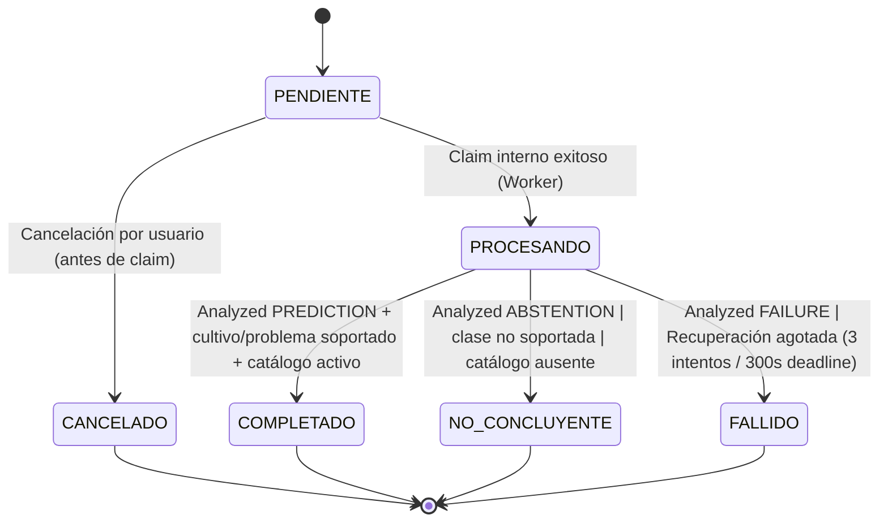
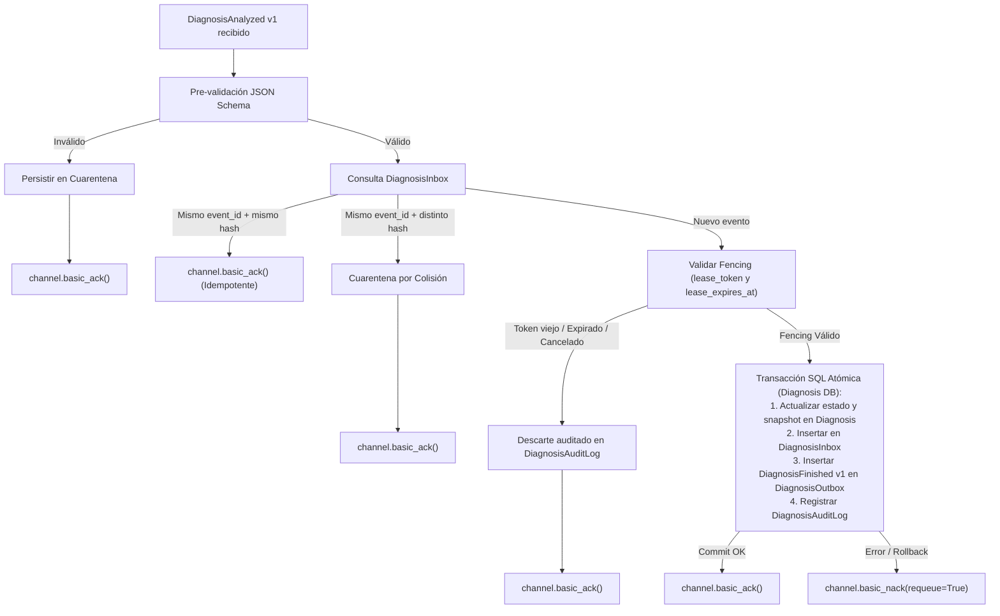

# Invariantes de Finalización, Decisión y Recuperación en Diagnosis

En conformidad con ADR-0008 (D1, D4, D5, D6, D7, D8) y las tareas 6.1 a 6.4 del Incremento 3.

---

## 1. Propósito y Alcance

Este documento describe las garantías formales, las reglas de decisión de estado, el protocolo de descarte auditado y las invariantes de concurrencia que rigen el ciclo de vida final de un diagnóstico en el servicio `services/diagnosis`.

En la arquitectura asíncrona de AgroDiagnóstico V1, **el servicio Diagnosis es el único dueño y árbitro del estado del diagnóstico**. El worker `ai_inference` provee exclusivamente resultados técnicos provisionales (`DiagnosisAnalyzed`), pero jamás decide si un diagnóstico es concluyente ni si es visible para los usuarios.

---

## 2. Invariantes Fundamentales de Estado

### Invariantes de Transición

1. **Irreversibilidad Terminal**:
   - Los estados `COMPLETADO`, `NO_CONCLUYENTE`, `FALLIDO` y `CANCELADO` son estrictamente terminales.
   - Una vez alcanzado un estado terminal, ninguna operación, mensaje tardío ni evento de transporte puede modificar el estado ni revivir el diagnóstico.
2. **Propiedad y Decisión Local de Diagnosis**:
   - `ABSTENTION` en `DiagnosisAnalyzed` siempre transiciona a `NO_CONCLUYENTE`, asignando el `reason_code` técnico informado (p. ej., `LOW_CONFIDENCE`, `BAD_IMAGE`).
   - `FAILURE` en `DiagnosisAnalyzed` transiciona a `FALLIDO`, preservando el `failure_code` / `reason_code` reportado.
   - `PREDICTION` solo transiciona a `COMPLETADO` si y solo si:
     - El cultivo detectado existe y está activo.
     - El problema detectado tiene `model_supported = True`.
     - Existe una recomendación aprobada y activa en el catálogo agrícola para dicha combinación.
   - Si la predicción corresponde a una clase con `model_supported = False`, Diagnosis fuerza la transición a `NO_CONCLUYENTE` con motivo `UNSUPPORTED_CLASS`.
   - Si el cultivo o la recomendación faltan en el catálogo, Diagnosis transiciona a `NO_CONCLUYENTE` con motivo `CATALOG_UNAVAILABLE`.
3. **Inmutabilidad del Snapshot Técnico y de Catálogo**:
   - Al transicionar a `COMPLETADO`, Diagnosis copia y congela en la fila del diagnóstico el snapshot técnico (predicción, confianza, versión del modelo) y el snapshot del catálogo (orientación y recomendaciones vigentes al momento de la resolución).
   - Cualquier actualización, desactivación o modificación posterior en las tablas del catálogo (`crops`, `crop_diseases`, `treatments`) **no altera** el snapshot congelado del diagnóstico completado.
4. **Retroalimentación de Usuario (`User Feedback`)**:
   - Cualquier diagnóstico en estado terminal (`COMPLETADO`, `NO_CONCLUYENTE` o `FALLIDO`) conserva la capacidad de recibir retroalimentación del usuario (escala 1 a 5 y comentario opcional), con restricción de cardinalidad 1:1.

---

## 3. Atomicidad de la Finalización y Regla de Evento Finished

Para prevenir inconsistencias entre el estado persistido, la bandeja de deduplicación y la emisión de eventos hacia el broker:

### Invariantes de la Transacción Atómica

1. **Commit Unificado**:
   - En una **única transacción SQL**, se confirman simultáneamente:
     - El cambio de estado y snapshot de `Diagnosis`.
     - El registro del mensaje procesado en `DiagnosisInbox` (con `event_id`, `canonical_hash`, `source_service="ai_inference"`).
     - El evento `DiagnosisFinished` v1 en `DiagnosisOutbox`.
     - El registro en `DiagnosisAuditLog`.
2. **ACK Post-Commit Estricto**:
   - `channel.basic_ack()` se invoca **únicamente después** de que la transacción de base de datos ha hecho `commit()` exitoso.
   - Si la transacción falla o hace rollback (p. ej., fallo de BD o error en la inserción de outbox), se emite `channel.basic_nack(requeue=True)` y ningún estado queda parcialmente confirmado.
3. **Regla del Evento Finished Único**:
   - Se emite **exactamente un evento `DiagnosisFinished`** por diagnóstico cuando este transiciona a `COMPLETADO`, `NO_CONCLUYENTE` o `FALLIDO`.
   - **`CANCELADO` nunca emite `DiagnosisFinished`**: La cancelación es una acción previa a la inferencia y no genera notificación de finalización de análisis.
   - Las reentregas de transporte o duplicados de redelivery jamás emiten un segundo evento `DiagnosisFinished`.

---

## 4. Fencing y Protocolo de Descarte Auditado

Para mitigar condiciones de carrera causadas por retrasos de red, workers zombis o redelivery tardío:

1. **Reloj Relacional de PostgreSQL**:
   - La validez de un lease se evalúa contra el tiempo de la base de datos (`CURRENT_TIMESTAMP < lease_expires_at`).
   - Si el tiempo de expiración se ha alcanzado o superado, el lease se considera expirado.
2. **Coincidencia Estricta de `lease_token`**:
   - El resultado recibido en `DiagnosisAnalyzed` debe incluir el `lease_token` emitido durante el reclamo vigente.
   - Si el diagnóstico fue reclamado por un segundo intento (generando un nuevo token), cualquier resultado que porte el token anterior se clasifica como `STALE_LEASE_TOKEN` y es descartado.
3. **Descarte Seguro sin Mutación**:
   - Si el diagnóstico se encuentra en estado `CANCELADO`, o si el lease expiró, o si el token es obsoleto:
     - El resultado **se descarta sin modificar** el estado de `Diagnosis`.
     - Se registra una entrada en `DiagnosisAuditLog` detallando el motivo (`EXPIRED_LEASE`, `STALE_LEASE_TOKEN`, `TERMINAL_STATE_DISCARD`).
     - No se consume presupuesto de reintentos adicional.
     - El mensaje AMQP es reconocido con `channel.basic_ack()` para drenarlo del broker.
4. **Preservación de Tombstones (`Soft-Delete`)**:
   - Un diagnóstico marcado con `deleted_at IS NOT NULL` (tombstone) que mantiene un lease vigente puede finalizarse técnicamente de forma interna para cerrar el ciclo, pero su marca de eliminación y su invisibilidad ante el usuario se preservan intactas (`deleted_at` nunca se limpia).

---

## 5. Servicio de Recuperación de Leases (`recover_expired_leases`)

El servicio de recuperación actúa como guardián ante workers caídos o desconexiones silenciosas:

1. **Aislamiento de Diagnósticos sin Reclamo**:
   - Diagnósticos en `PENDIENTE` sin reclamo (`lease_counter == 0`) no tienen lease activo ni deadline; el recuperador **los ignora**.
2. **Selección Concurrente Segura**:
   - Escanea diagnósticos en `PROCESANDO` con `lease_expires_at <= CURRENT_TIMESTAMP` utilizando `SELECT ... FOR UPDATE SKIP LOCKED` para permitir múltiples instancias del servicio sin colisiones.
3. **Ventanas Mínimas de Espera Pos-Expiración**:
   - Para evitar carreras con workers que están enviando su resultado al broker al momento exacto de la expiración, el recuperador exige una holgura antes de actuar:
     - **Generación 1** (`lease_counter == 1`): espera mínima de **5 segundos** tras `lease_expires_at`.
     - **Generación 2 y 3** (`lease_counter >= 2`): espera mínima de **15 segundos** tras `lease_expires_at`.
4. **Señalización Única por Generación**:
   - La columna `recovery_signaled_at` registra el instante en que se emitió la señal de recuperación para la generación en curso.
   - Pasadas sucesivas del recuperador no emitirán señales duplicadas para la misma generación mientras el intento no haya cambiado.
5. **Presupuesto Máximo de 3 Intentos y 300 Segundos**:
   - Si `lease_counter < 3` y no se ha alcanzado `processing_deadline_at`:
     - El recuperador inserta en `DiagnosisOutbox` un nuevo evento `DiagnosisRequested` v2 con `attempt_number = lease_counter + 1`.
     - Actualiza `recovery_signaled_at = CURRENT_TIMESTAMP`.
   - Si `lease_counter >= 3` o `CURRENT_TIMESTAMP >= processing_deadline_at`:
     - El presupuesto está formalmente agotado.
     - Transiciona atómicamente a `FALLIDO` con `reason_code = PROCESSING_TIMEOUT`.
     - Inserta en `DiagnosisOutbox` el único evento `DiagnosisFinished` v1 con `final_status = FALLIDO`.
     - Limpia los tokens de lease para evitar reclamos tardíos.

---

## 6. Matriz de Conteos Esperados de Filas y Eventos

A continuación se detalla la matriz de cardinalidad y efectos de persistencia para cada escenario operacional:

| Escenario Operativo | Estado Final `Diagnosis` | Filas en `diagnosis_inbox` | Filas en `diagnosis_outbox` | Eventos AMQP Emitidos | Filas en `quarantine` | Entradas `audit_log` relevantes |
| :--- | :--- | :---: | :---: | :---: | :---: | :--- |
| **Flujo Exitoso Directo (PREDICTION)** | `COMPLETADO` | 1 | 2 (`Requested` v2 + `Finished` v1) | 2 | 0 | `DIAGNOSIS_CREATED`, `DIAGNOSIS_CLAIMED`, `DIAGNOSIS_FINALIZED` |
| **Abstención del Modelo (ABSTENTION)** | `NO_CONCLUYENTE` | 1 | 2 (`Requested` v2 + `Finished` v1) | 2 | 0 | `DIAGNOSIS_CREATED`, `DIAGNOSIS_CLAIMED`, `DIAGNOSIS_FINALIZED` |
| **Fallo Técnico del Worker (FAILURE)** | `FALLIDO` | 1 | 2 (`Requested` v2 + `Finished` v1) | 2 | 0 | `DIAGNOSIS_CREATED`, `DIAGNOSIS_CLAIMED`, `DIAGNOSIS_FINALIZED` |
| **Clase No Soportada por Catálogo** | `NO_CONCLUYENTE` | 1 | 2 (`Requested` v2 + `Finished` v1) | 2 | 0 | `DIAGNOSIS_CREATED`, `DIAGNOSIS_CLAIMED`, `DIAGNOSIS_FINALIZED` |
| **Redelivery Idempotente (Mismo Hash)** | *(Sin cambio)* | 1 | 0 adicionales | 0 adicionales | 0 | *(Sin eventos ni cambios extra)* |
| **Colisión de Hash en `event_id`** | *(Sin cambio)* | 1 *(original)* | 0 adicionales | 0 adicionales | 1 | `INBOX_COLLISION_QUARANTINED` |
| **Mensaje Inválido / Schema Corrupto** | *(Sin cambio)* | 0 | 0 adicionales | 0 adicionales | 1 | *(Auditado en cuarentena)* |
| **Resultado Tardío con Lease Expirado** | *(Sin cambio)* | 0 | 0 adicionales | 0 adicionales | 0 | `LATE_RESULT_DISCARDED (EXPIRED_LEASE)` |
| **Token Obsoleto de Generación Previa** | *(Sin cambio)* | 0 | 0 adicionales | 0 adicionales | 0 | `STALE_LEASE_TOKEN_DISCARDED` |
| **Resultado para Diagnóstico Cancelado** | `CANCELADO` | 0 | 0 adicionales | 0 adicionales | 0 | `LATE_RESULT_DISCARDED (CANCELADO)` |
| **Muerte Worker Intento 1 + Éxito en Intento 2** | `COMPLETADO` | 1 | 3 (`Requested` v2 gen 1 + `Requested` v2 gen 2 + `Finished` v1) | 3 | 0 | `DIAGNOSIS_CLAIMED` (x2), `RECOVERY_SIGNALED`, `DIAGNOSIS_FINALIZED` |
| **Agotamiento Total (3 Intentos Expirados)** | `FALLIDO` | 0 | 4 (`Requested` gen 1, 2, 3 + `Finished` v1) | 4 | 0 | `DIAGNOSIS_CLAIMED` (x3), `RECOVERY_TIMEOUT_FINALIZED` |
| **Vencimiento de Deadline Global (300s)** | `FALLIDO` | 0 | 2+ (`Requested` + `Finished` v1) | 2+ | 0 | `RECOVERY_TIMEOUT_FINALIZED (DEADLINE_EXCEEDED)` |
| **Tombstone Finalizado Válidamente** | `COMPLETADO` *(deleted)* | 1 | 2 (`Requested` v2 + `Finished` v1) | 2 | 0 | `DIAGNOSIS_FINALIZED` *(deleted_at preservado)* |

---

## 7. Verificación Automatizada

Los invariantes descritos en esta especificación se encuentran rigurosamente probados en las siguientes suites:
- `services/diagnosis/tests/test_analyzed_consumer.py`: Cubre la pre-validación de esquema, inbox deduplication, colisiones, mapping de `ABSTENTION`/`FAILURE`/`PREDICTION`, snapshot de catálogo inmutable, atomicidad de commit, feedback de usuario en terminales y descarte auditado de leases tardíos y diagnósticos cancelados.
- `services/diagnosis/tests/test_lease_recovery_service.py`: Cubre la recuperación idempotente con señal única por generación, esperas mínimas de 5s/15s, ignorado de diagnósticos `PENDIENTE` sin claim, presupuesto de 3 intentos, límite de 300s y carreras concurrentes entre resultado técnico y recuperador.

